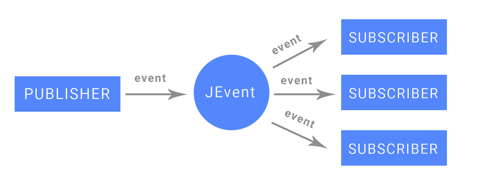

# KEvent: A brand new communication library in Android & Kotlin (similar to Eventbus)
[](https://github.com/janbarari/kevent)
[](https://github.com/janbarari/kevent)
[](https://github.com/janbarari/kevent)
[](https://github.com/janbarari/kevent)

KEvent is an open-source library for kotlin using the publisher/subscriber pattern for loose coupling. KEvent enables central communication to decoupled classes with just a few lines of code - simplifying the code, removing dependencies and speeding up app development.



Benefits
--------
- Global observers that always alive
- Is none class implementation(no need to use in a class body - unlike Eventbus)
- Simplifies the communication between components
- Using Kotlin high-order functions
- Decouples event sender
- Is fast like EventBus
- Is smaller than EventBus
- Typed Observers that only accept events with determined Type
- Post to specific observer
- Post to specific observer with sender class
- Event validation: Only Serializable/Parcelable data will be transferring, Events that are smaller than specific size(bytes) can be transferring(Due to avoid memory leak and increase the performance and speed, by default there is no size limitation added)

Installation
------------
```gradle
allprojects {
    repositories {
        maven { url 'https://jitpack.io' }
    }
}

implementation 'com.github.janbarari:kevent:v1.1.0'
```

Setup
-----
```kotlin
//Register observer
KEvent.register<T>("ObserverID") { event ->
    //Notice: event type is T, the Only events with the type of T can be observed here
}
KEvent.registerWithSender<T, Sender>("ObserverID") { event ->
    //Notice: event type is T, the Only events with the type of T and posted from sender class can be observed here
}

//Unregister observer
KEvent.unregister("ObserverID")

//Post to all observers that can accept the type of T
KEvent.post(T)
//Post to an observer with the mentioned ID that can accept the type of T
KEvent.post(T, "ObserverID")
//Post to an observer with the mentioned ID and sender class that can accept the type of T
KEvent.postWithSender<Sender>(T, "ObserverID")
```
Sponsor
-------
### If you like and use it, please tap the Star(⭐️) button at the above.  
This source code is free for all; hence, it's not profitable. You can make me happy by donating me :)

[](https://blockchair.com/dogecoin/address/DB87foUxetrQRpAbWkrhexZeVtnzwyqhSL)

[](https://blockchair.com/bitcoin/address/bc1qj30t3hmw0gat3vmwye972ce4sfrc5r5mz0ctr6)

License
-------
Copyright (C) 2020 Mehdi Janbarari  
KEvent binaries and source code can be used according to the [Apache License, Version 2.0](LICENSE).

